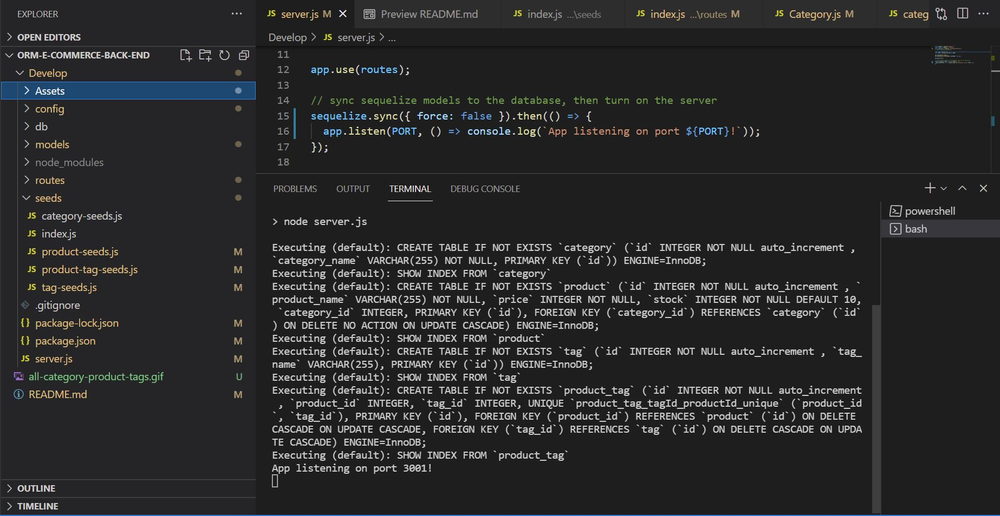
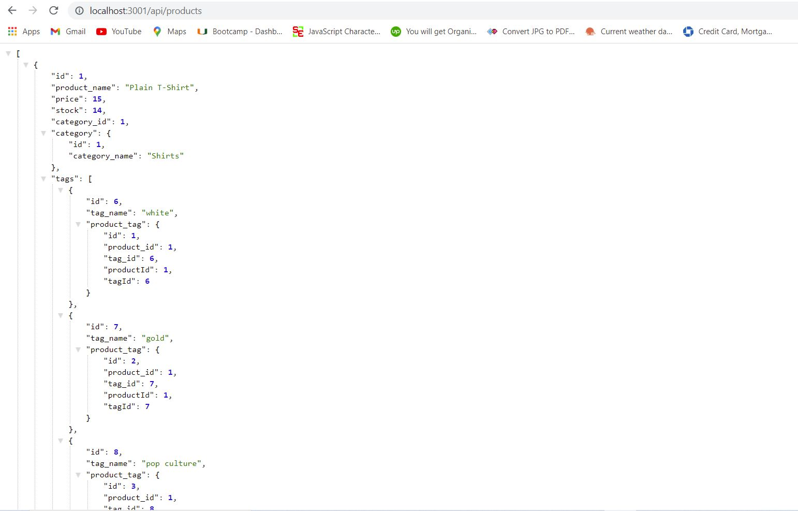
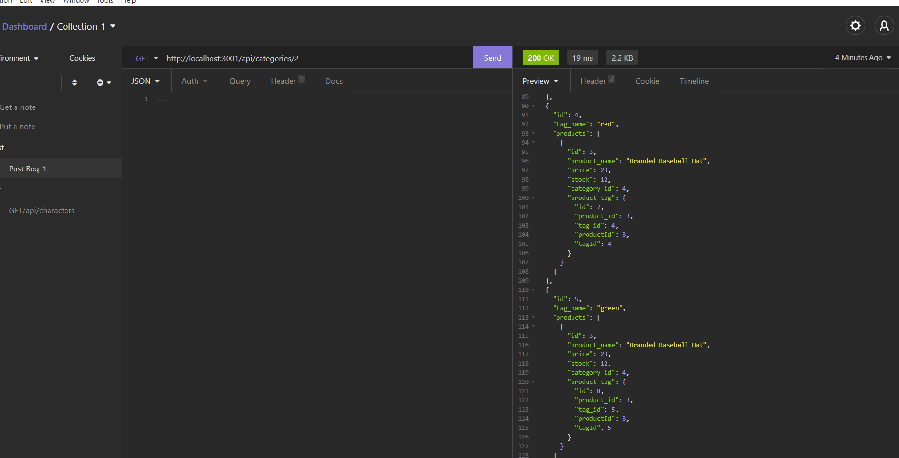
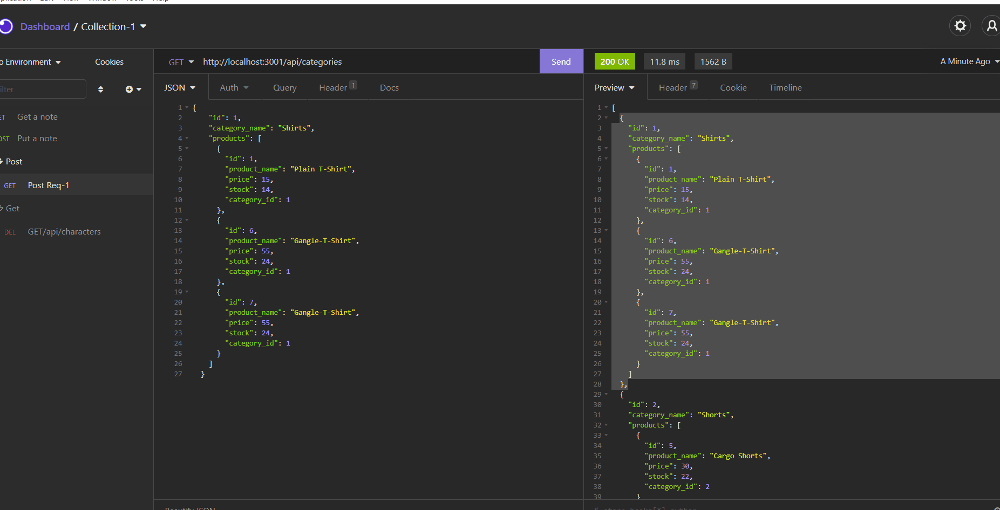
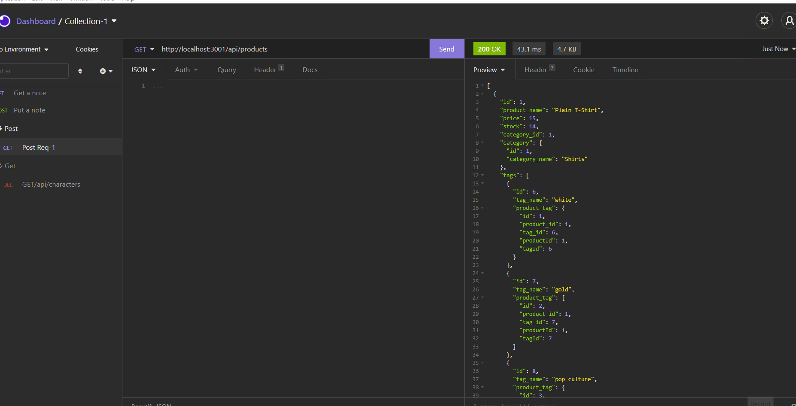
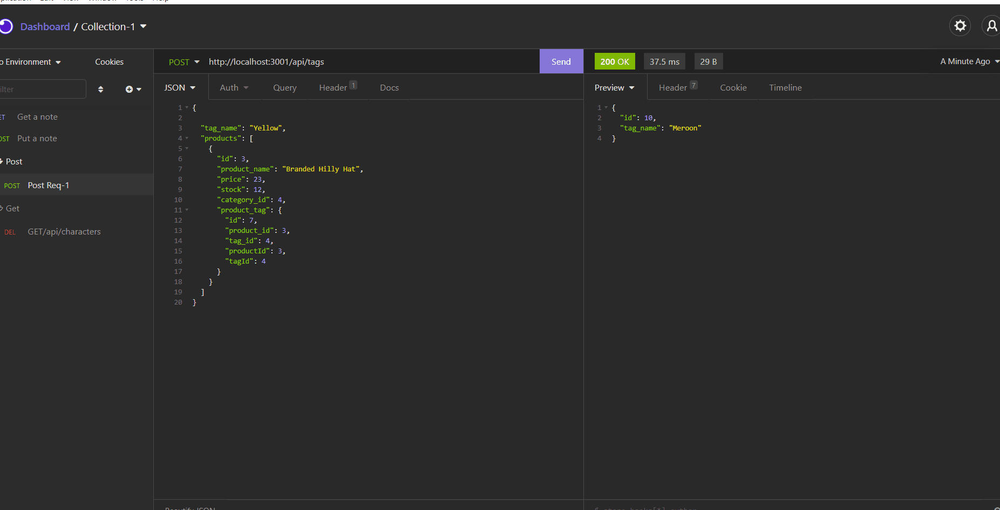

<h1 align="center">Object-Relational-Mapping (ORM): E-commerce Back End 👋</h1>

## Description

*ORM E Commerce is a Back end API built for the back end developers. This API is built using Express.js and configure it to use Sequelize to interact with a MySQL database.*

## Table of Contents

- [Description](#description)
- [Table of Contents](#table-of-contents)
- [App Demo](#app-demo)
- [Overview Links](#overview-links)
- [User Story](#user-story)
- [Acceptance Criteria](#acceptance-criteria)
- [Database Models](#database-models)
- [Associations](#associations)
- [Installation](#installation)
- [Usage](#usage)
- [Contributing](#contributing)
- [Questions](#questions)

## App Demo
- Picture of Application


- Picture of Server Function


- Create Schema and Seed data


- GET routes to return all categories, all products and all tags


- GET routes to return a single category, a single product, and a single tag



- POST, PUT, and DELETE routes for categories



- POST, PUT, and DELETE routes for Products



- POST, PUT, and DELETE routes for Tags



## Overview Links
- [Application walkthrough](https://drive.google.com/file/d/10Lc6qOoBlbw_mf55MkFXn0_AhzZeAzGF/view)
- [GitHub Repository](https://mirzadev.github.io/ORM-ECommerce-Back-End/)

## User Story

```text
AS A manager at an internet retail company
I WANT a back end for my e-commerce website that uses the latest technologies
SO THAT my company can compete with other e-commerce companies
```

## Acceptance Criteria

```text
GIVEN a functional Express.js API
WHEN I add my database name, MySQL username, and MySQL password to an environment variable file
THEN I am able to connect to a database using Sequelize
WHEN I enter schema and seed commands
THEN a development database is created and is seeded with test data
WHEN I enter the command to invoke the application
THEN my server is started and the Sequelize models are synced to the MySQL database
WHEN I open API GET routes in Insomnia Core for categories, products, or tags
THEN the data for each of these routes is displayed in a formatted JSON
WHEN I test API POST, PUT, and DELETE routes in Insomnia Core
THEN I am able to successfully create, update, and delete data in my database
```

### Database Models

- `Category`

    - `id`
        - Integer
        - Doesn't allow null values
        - Set as primary key
        - Uses auto increment

    - `category_name`
        - String
        - Doesn't allow null values

- `Product`

    - `id`
        - Integer
        - Doesn't allow null values
        - Set as primary key
        - Uses auto increment

    - `product_name`
        - String
        - Doesn't allow null values

    - `price`
        - Decimal
        - Doesn't allow null values
        - Validates that the value is a decimal

    - `stock`
        - Integer
        - Doesn't allow null values
        - Set a default value of 10
        - Validates that the value is numeric

    - `category_id`
        - Integer
        - References the category model's id

- `Tag`

    - `id`
        - Integer
        - Doesn't allow null values
        - Set as primary key
        - Uses auto increment

    - `tag_name`
        - String

- `ProductTag`

    - `id`
        - Integer
        - Doesn't allow null values
        - Set as primary key
        - Uses auto increment

    - `product_id`
        - Integer
        - References the product model's id

    - `tag_id`
        - Integer
        - References the tag model's id

## Associations

*I have executed association methods on my Sequelize models to create the following relationships between them:*

- Product belongs to Category, as a category can have multiple products but a product can only belong to one category.

- Category has many Product models.

- Product belongs to many Tag models. Using the ProductTag through model, allow products to have multiple tags and tags to have many products.

- Tag belongs to many Product models.

## Installation
💾   
  
`npm init`
  
`npm install express`

`npm install mysql2`

`npm install sequelize`

  
## Usage
💻   
  
Run the following command at the root of your project and answer the prompted questions:

`npm run seeds`
  
`npm start`

## Contributing
:My Github Link: [Mirza Awal](https://github.com/mirzadev)

## Questions
✉️ Contact me with any questions: [email](mailto:awal.mirza2016@gmail.com) , [LinkedIn](https://www.linkedin.com/in/mirza-awal-5972511b5/)<br />
